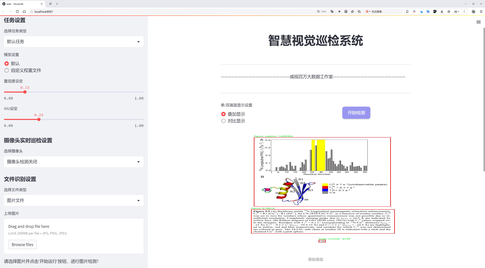

# 文章结构元素分析检测系统源码分享
 # [一条龙教学YOLOV8标注好的数据集一键训练_70+全套改进创新点发刊_Web前端展示]

### 1.研究背景与意义

项目参考[AAAI Association for the Advancement of Artificial Intelligence](https://gitee.com/qunmasj/projects)

项目来源[AACV Association for the Advancement of Computer Vision](https://kdocs.cn/l/cszuIiCKVNis)

研究背景与意义

在信息爆炸的时代，学术论文的数量和复杂性不断增加，如何有效地分析和提取论文中的结构元素已成为学术研究和信息管理领域的重要课题。传统的手动分析方法不仅耗时耗力，而且容易受到主观因素的影响，导致分析结果的不一致性和低效率。因此，开发一种高效、自动化的论文结构元素分析系统显得尤为重要。近年来，深度学习技术的迅猛发展为这一问题的解决提供了新的思路，尤其是目标检测模型的应用，使得自动化分析成为可能。

YOLO（You Only Look Once）系列模型因其高效的实时目标检测能力而受到广泛关注。YOLOv8作为该系列的最新版本，具备更强的特征提取能力和更高的检测精度，适合用于复杂场景下的目标识别任务。通过对YOLOv8的改进，我们可以构建一个专门针对学术论文结构元素的分析系统。该系统能够自动识别和分类论文中的各类结构元素，如标题、摘要、章节、图表、公式等，从而为后续的文献分析、信息检索和知识图谱构建提供基础。

本研究所使用的数据集包含12000张图像，涵盖46个类别的结构元素，提供了丰富的样本用于训练和验证模型。这些类别不仅包括论文的基本组成部分，如标题、作者、摘要和参考文献，还包括更细致的元素，如定理、引理、算法和图表等。这种多样性使得模型能够学习到不同结构元素的特征，从而提高识别的准确性和鲁棒性。

通过改进YOLOv8模型，我们的目标是实现对学术论文结构元素的高效自动化分析。这一系统的应用不仅可以提高文献管理的效率，还可以为学术研究提供更为精准的文献综述和数据挖掘支持。具体而言，研究人员可以借助该系统快速定位和提取所需信息，减少手动查找的时间成本；同时，系统生成的结构化数据可以为后续的机器学习和自然语言处理任务提供重要的基础数据，推动智能文献分析工具的发展。

此外，本研究的意义还在于推动学术界对论文结构分析的深入理解。通过对论文结构元素的系统化分析，我们可以揭示不同学科领域、不同类型论文在结构上的共性与差异，进而为学术写作提供指导和参考。这不仅有助于提升学术论文的写作质量，也为新兴研究领域的规范化发展提供了依据。

综上所述，基于改进YOLOv8的学术论文结构元素分析系统的研究，不仅具有重要的理论价值，也具备广泛的应用前景。通过自动化的分析手段，我们可以更好地应对信息过载带来的挑战，推动学术研究的高效进行，促进知识的传播与共享。

### 2.图片演示





##### 注意：由于此博客编辑较早，上面“2.图片演示”和“3.视频演示”展示的系统图片或者视频可能为老版本，新版本在老版本的基础上升级如下：（实际效果以升级的新版本为准）

  （1）适配了YOLOV8的“目标检测”模型和“实例分割”模型，通过加载相应的权重（.pt）文件即可自适应加载模型。

  （2）支持“图片识别”、“视频识别”、“摄像头实时识别”三种识别模式。

  （3）支持“图片识别”、“视频识别”、“摄像头实时识别”三种识别结果保存导出，解决手动导出（容易卡顿出现爆内存）存在的问题，识别完自动保存结果并导出到tempDir中。

  （4）支持Web前端系统中的标题、背景图等自定义修改，后面提供修改教程。

  另外本项目提供训练的数据集和训练教程,暂不提供权重文件（best.pt）,需要您按照教程进行训练后实现图片演示和Web前端界面演示的效果。

### 3.视频演示

[3.1 视频演示](https://www.bilibili.com/video/BV1pbsSeeE3h/)

### 4.数据集信息展示

##### 4.1 本项目数据集详细数据（类别数＆类别名）

nc: 19
names: ['author', 'chapter', 'equation number', 'equation', 'figure caption', 'figure', 'footnote', 'list of content heading', 'list of content text', 'page number', 'paragraph', 'reference text', 'section', 'subsection', 'subsubsection', 'table caption', 'table of contents text', 'table', 'title']


##### 4.2 本项目数据集信息介绍

数据集信息展示

在本研究中，我们采用了名为“paper parts”的数据集，以支持对YOLOv8模型的改进，旨在提升其在学术论文结构元素分析中的表现。该数据集包含19个类别，涵盖了学术论文中常见的结构元素，具体包括：作者、章节、公式编号、公式、图例、图、脚注、内容列表标题、内容列表文本、页码、段落、参考文本、节、小节、次小节、表格标题、目录文本、表格以及标题。这些类别的选择反映了学术论文的基本构成，能够有效地帮助模型识别和分析论文中的各个部分。

“paper parts”数据集的设计旨在为机器学习模型提供丰富的训练样本，使其能够在实际应用中准确地识别和分类学术论文的不同结构元素。每个类别都代表了论文中不可或缺的组成部分，这些部分不仅在信息传递中起着关键作用，还在论文的整体结构和逻辑流畅性中扮演着重要角色。例如，作者信息和标题是论文的基本标识，而章节、节和小节则为读者提供了清晰的导航，帮助他们快速找到所需的信息。此外，公式、图表和参考文献等元素则为论文的论证提供了必要的支持和证据。

在数据集的构建过程中，研究团队注重确保样本的多样性和代表性，以涵盖不同学科和研究领域的论文风格。这种多样性不仅增强了模型的泛化能力，还提高了其在实际应用中的适应性。数据集中的每个类别都经过精心标注，确保模型在训练过程中能够学习到准确的特征，从而在推理阶段实现高效的识别和分类。

为了进一步提升YOLOv8在论文结构元素分析中的性能，我们还对数据集进行了预处理和增强。这包括图像的旋转、缩放、裁剪等操作，以模拟不同的输入场景，增加模型的鲁棒性。同时，我们还引入了数据平衡策略，确保每个类别在训练过程中都有足够的样本，从而避免模型对某些类别的偏倚。

通过对“paper parts”数据集的深入分析和利用，我们期望能够显著提升YOLOv8在学术论文结构元素识别任务中的表现。这不仅将推动自动化文献分析技术的发展，也为学术研究提供了更为高效的工具，帮助研究人员更好地获取和整理信息。最终，我们希望这一研究能够为学术界带来实质性的贡献，推动学术交流和知识传播的效率。


### 5.全套项目环境部署视频教程（零基础手把手教学）

[5.1 环境部署教程链接（零基础手把手教学）](https://www.ixigua.com/7404473917358506534?logTag=c807d0cbc21c0ef59de5)


[5.2 安装Python虚拟环境创建和依赖库安装视频教程链接（零基础手把手教学）](https://www.ixigua.com/7404474678003106304?logTag=1f1041108cd1f708b01a)

### 6.手把手YOLOV8训练视频教程（零基础小白有手就能学会）

[6.1 手把手YOLOV8训练视频教程（零基础小白有手就能学会）](https://www.ixigua.com/7404477157818401292?logTag=d31a2dfd1983c9668658)

### 7.70+种全套YOLOV8创新点代码加载调参视频教程（一键加载写好的改进模型的配置文件）

[7.1 70+种全套YOLOV8创新点代码加载调参视频教程（一键加载写好的改进模型的配置文件）](https://www.ixigua.com/7404478314661806627?logTag=29066f8288e3f4eea3a4)

### 8.70+种全套YOLOV8创新点原理讲解（非科班也可以轻松写刊发刊，V10版本正在科研待更新）

由于篇幅限制，每个创新点的具体原理讲解就不一一展开，具体见下列网址中的创新点对应子项目的技术原理博客网址【Blog】：


[8.1 70+种全套YOLOV8创新点原理讲解链接](https://gitee.com/qunmasj/good)

### 9.系统功能展示（检测对象为举例，实际内容以本项目数据集为准）

图9.1.系统支持检测结果表格显示

  图9.2.系统支持置信度和IOU阈值手动调节

  图9.3.系统支持自定义加载权重文件best.pt(需要你通过步骤5中训练获得)

  图9.4.系统支持摄像头实时识别

  图9.5.系统支持图片识别

  图9.6.系统支持视频识别

  图9.7.系统支持识别结果文件自动保存

  图9.8.系统支持Excel导出检测结果数据


### 10.原始YOLOV8算法原理

原始YOLOv8算法原理

YOLOv8是由Ultralytics公司于2023年推出的目标检测算法，标志着YOLO系列的又一次重大进步。该算法不仅在性能上超越了前代模型，还在灵活性和易用性方面进行了显著的改进。YOLOv8的架构设计以其高效的特征提取和检测能力而闻名，尤其是其在处理复杂场景时的表现，充分展现了深度学习技术在计算机视觉领域的潜力。

YOLOv8的核心架构由三个主要部分组成：Backbone、Neck和Head。Backbone负责从输入图像中提取特征，Neck则用于多尺度特征的融合，而Head则负责最终的目标检测任务。与之前的YOLO版本相比，YOLOv8在Backbone部分采用了CSPDarknet结构，这种结构将特征提取过程分为两个分支，每个分支都包含多个残差块，从而提高了特征提取的效率和模型的表达能力。CSP结构的引入有效地增强了网络的梯度流，避免了深层网络中常见的梯度消失问题，使得模型在训练过程中能够更好地学习到有效的特征。

在YOLOv8中，C2f模块取代了YOLOv5中的C3模块，C2f模块通过将输入特征图分为两个分支，分别进行卷积处理，进一步增强了特征的多样性和丰富性。每个分支经过卷积后再进行融合，这种设计不仅提升了特征图的维度，还使得模型能够捕捉到更细致的特征信息。C2f模块的创新设计在于其能够有效地利用网络中的每一层信息，提升了特征的表达能力。

YOLOv8还引入了快速空间金字塔池化（SPPF）模块，这一模块的设计旨在提取不同尺度的特征，尤其是在处理多尺度目标时，SPPF能够显著提高模型的性能。通过对特征图进行多尺度处理，SPPF能够有效减少模型的参数量和计算量，同时提升特征提取的效率。这一设计使得YOLOv8在面对复杂场景时，能够更快速地进行特征提取，从而加快整体的推理速度。

在Neck部分，YOLOv8采用了特征金字塔网络（FPN）与路径聚合网络（PAN）的结合，这一结构能够实现特征的多尺度融合，进一步提升目标检测的准确性。通过对不同层次的特征进行有效的整合，YOLOv8能够在不同尺度上对目标进行精确的定位和分类。PAN结构的引入，使得模型在处理复杂背景和多目标场景时，能够保持较高的检测精度。

YOLOv8的检测网络采用了无锚框（Anchor-Free）检测方式，这一创新使得模型能够直接预测目标的中心点及其宽高比例，减少了对Anchor框的依赖。这种方式不仅简化了模型的设计，还提高了检测速度和准确度。通过直接预测目标的几何信息，YOLOv8能够更灵活地适应不同类型的目标，尤其是在目标形状和大小变化较大的情况下，表现出色。

在损失函数方面，YOLOv8采用了CloU损失函数，这一损失函数在目标检测任务中表现出了良好的效果。CloU损失函数通过综合考虑目标的定位和分类信息，能够有效地引导模型学习到更准确的特征表示，进而提升检测的精度。

总的来说，YOLOv8在设计上充分考虑了目标检测任务的复杂性，通过引入多种创新技术，提升了模型的性能和灵活性。其高效的特征提取能力、灵活的检测方式以及强大的多尺度特征融合能力，使得YOLOv8成为当前目标检测领域的领先模型之一。随着YOLOv8的发布，研究人员和开发者们在实际应用中将能够更好地利用这一强大的工具，推动计算机视觉技术的进一步发展。


### 11.项目核心源码讲解（再也不用担心看不懂代码逻辑）

#### 11.1 ui.py

以下是经过简化和注释的核心代码部分：

```python
import sys
import subprocess
from QtFusion.path import abs_path

def run_script(script_path):
    """
    使用当前 Python 环境运行指定的脚本。

    Args:
        script_path (str): 要运行的脚本路径
    """
    # 获取当前 Python 解释器的路径
    python_path = sys.executable

    # 构建运行命令，使用 streamlit 运行指定的脚本
    command = f'"{python_path}" -m streamlit run "{script_path}"'

    # 执行命令并等待其完成
    result = subprocess.run(command, shell=True)
    
    # 检查命令执行结果，如果返回码不为0，表示出错
    if result.returncode != 0:
        print("脚本运行出错。")

# 主程序入口
if __name__ == "__main__":
    # 获取脚本的绝对路径
    script_path = abs_path("web.py")

    # 运行指定的脚本
    run_script(script_path)
```

### 代码注释说明：
1. **导入模块**：
   - `sys`：用于获取当前 Python 解释器的路径。
   - `subprocess`：用于执行外部命令。
   - `abs_path`：从 `QtFusion.path` 导入的函数，用于获取文件的绝对路径。

2. **`run_script` 函数**：
   - 接受一个参数 `script_path`，表示要运行的 Python 脚本的路径。
   - 使用 `sys.executable` 获取当前 Python 解释器的路径。
   - 构建命令字符串，使用 `streamlit` 运行指定的脚本。
   - 使用 `subprocess.run` 执行命令，并等待其完成。
   - 检查命令的返回码，如果不为0，则打印错误信息。

3. **主程序入口**：
   - 在脚本作为主程序运行时，获取 `web.py` 的绝对路径。
   - 调用 `run_script` 函数来运行该脚本。

这个程序文件 `ui.py` 的主要功能是运行一个指定的 Python 脚本，具体来说是通过 Streamlit 框架来启动一个 Web 应用。程序的实现过程如下：

首先，文件导入了几个必要的模块，包括 `sys`、`os` 和 `subprocess`。其中，`sys` 模块用于访问与 Python 解释器相关的变量和函数，`os` 模块提供了与操作系统交互的功能，而 `subprocess` 模块则用于执行外部命令。

接着，程序从 `QtFusion.path` 模块中导入了 `abs_path` 函数，这个函数的作用是获取文件的绝对路径。

在 `run_script` 函数中，程序接收一个参数 `script_path`，该参数是要运行的脚本的路径。函数首先获取当前 Python 解释器的路径，这通过 `sys.executable` 实现。然后，构建一个命令字符串，该命令使用当前的 Python 解释器来运行指定的脚本，具体是通过 `streamlit run` 命令来启动 Web 应用。

接下来，使用 `subprocess.run` 方法执行构建好的命令。这个方法会在新的 shell 中运行命令，并等待命令执行完成。如果命令执行返回的状态码不为零，表示执行过程中出现了错误，程序会打印出“脚本运行出错”的提示信息。

在文件的最后部分，程序通过 `if __name__ == "__main__":` 判断是否是直接运行该脚本。如果是，程序会调用 `abs_path` 函数来获取 `web.py` 脚本的绝对路径，并将其传递给 `run_script` 函数以启动该脚本。

总的来说，这个 `ui.py` 文件的功能是通过 Streamlit 框架来运行一个名为 `web.py` 的 Python 脚本，提供了一个简单的方式来启动 Web 应用。

#### 11.2 code\ultralytics\nn\modules\utils.py

以下是代码中最核心的部分，并附上详细的中文注释：

```python
import torch
import torch.nn.functional as F

def multi_scale_deformable_attn_pytorch(
    value: torch.Tensor,
    value_spatial_shapes: torch.Tensor,
    sampling_locations: torch.Tensor,
    attention_weights: torch.Tensor,
) -> torch.Tensor:
    """
    多尺度可变形注意力机制。

    参数:
    - value: 输入特征图，形状为 (bs, C, num_heads, embed_dims)
    - value_spatial_shapes: 特征图的空间形状，形状为 (num_levels, 2)
    - sampling_locations: 采样位置，形状为 (bs, num_queries, num_heads, num_levels, num_points, 2)
    - attention_weights: 注意力权重，形状为 (bs, num_heads, num_queries, num_levels, num_points)

    返回:
    - output: 输出特征图，形状为 (bs, num_queries, num_heads * embed_dims)
    """

    # 获取输入的批次大小、通道数、头数和嵌入维度
    bs, _, num_heads, embed_dims = value.shape
    # 获取查询的数量、头数、层数和每层的采样点数
    _, num_queries, _, num_levels, num_points, _ = sampling_locations.shape
    
    # 将输入特征图按照空间形状分割成多个特征图
    value_list = value.split([H_ * W_ for H_, W_ in value_spatial_shapes], dim=1)
    
    # 将采样位置映射到[-1, 1]区间
    sampling_grids = 2 * sampling_locations - 1
    sampling_value_list = []
    
    # 遍历每一层的特征图
    for level, (H_, W_) in enumerate(value_spatial_shapes):
        # 对特征图进行重塑，以便进行采样
        value_l_ = value_list[level].flatten(2).transpose(1, 2).reshape(bs * num_heads, embed_dims, H_, W_)
        
        # 获取当前层的采样网格
        sampling_grid_l_ = sampling_grids[:, :, :, level].transpose(1, 2).flatten(0, 1)
        
        # 使用双线性插值对特征图进行采样
        sampling_value_l_ = F.grid_sample(
            value_l_, sampling_grid_l_, mode="bilinear", padding_mode="zeros", align_corners=False
        )
        
        # 将采样结果添加到列表中
        sampling_value_list.append(sampling_value_l_)
    
    # 将注意力权重进行重塑以匹配采样结果
    attention_weights = attention_weights.transpose(1, 2).reshape(
        bs * num_heads, 1, num_queries, num_levels * num_points
    )
    
    # 计算最终输出，通过加权求和得到
    output = (
        (torch.stack(sampling_value_list, dim=-2).flatten(-2) * attention_weights)
        .sum(-1)
        .view(bs, num_heads * embed_dims, num_queries)
    )
    
    # 返回输出，调整维度顺序
    return output.transpose(1, 2).contiguous()
```

### 代码核心部分解释：
1. **函数定义**：`multi_scale_deformable_attn_pytorch` 是实现多尺度可变形注意力机制的核心函数，输入包括特征图、空间形状、采样位置和注意力权重，输出为加权后的特征图。

2. **输入参数**：
   - `value`：包含特征图的张量，形状为 `(bs, C, num_heads, embed_dims)`。
   - `value_spatial_shapes`：特征图的空间形状，提供每层特征图的高度和宽度。
   - `sampling_locations`：用于采样的空间位置，包含每个查询点的采样位置。
   - `attention_weights`：每个查询点的注意力权重。

3. **处理流程**：
   - 将输入特征图根据空间形状分割为多个特征图。
   - 将采样位置转换到[-1, 1]区间，以便于后续的插值操作。
   - 对每一层特征图进行重塑和采样，使用双线性插值获取对应的特征值。
   - 最后，利用注意力权重对采样结果进行加权求和，得到最终的输出特征图。

4. **输出**：调整维度后返回的输出特征图，形状为 `(bs, num_queries, num_heads * embed_dims)`。

这个程序文件是一个用于实现多尺度可变形注意力机制的工具模块，主要用于深度学习中的YOLO（You Only Look Once）目标检测模型。文件中包含了一些常用的函数和初始化方法，以下是对代码的逐行解释。

首先，文件导入了一些必要的库，包括`copy`、`math`、`numpy`、`torch`及其子模块`torch.nn`和`torch.nn.functional`。这些库提供了深度学习所需的基本功能和数学运算。

接下来，定义了一个名为`_get_clones`的函数，它接受一个模块和一个整数n作为参数，返回一个包含n个深拷贝模块的`ModuleList`。这个函数在构建神经网络时非常有用，可以用来创建多个相同的层。

`bias_init_with_prob`函数用于根据给定的先验概率初始化卷积或全连接层的偏置值。它通过对数几率的转换计算出偏置的初始值，以便在训练过程中能够更好地学习。

`linear_init`函数用于初始化线性模块的权重和偏置。它使用均匀分布在一个范围内初始化权重，范围由输入特征的数量决定。如果模块有偏置，则也会对偏置进行相同的初始化。

`inverse_sigmoid`函数计算输入张量的反sigmoid函数。它首先将输入限制在0到1之间，然后通过对数运算计算反sigmoid值。这个函数在某些模型中可能用于反向传播或损失计算。

`multi_scale_deformable_attn_pytorch`函数实现了多尺度可变形注意力机制。该函数接受四个参数：`value`（输入特征）、`value_spatial_shapes`（特征的空间形状）、`sampling_locations`（采样位置）和`attention_weights`（注意力权重）。函数首先获取输入特征的维度信息，然后将输入特征根据空间形状进行分割。接着，计算采样网格并对每个尺度的特征进行采样，使用`F.grid_sample`函数进行双线性插值。

在处理完所有尺度的特征后，函数将注意力权重进行调整，并将所有采样值和注意力权重相乘，最后将结果汇总并调整维度，返回最终的输出。这种多尺度的可变形注意力机制能够更好地捕捉不同尺度下的特征信息，从而提高模型的性能。

总的来说，这个模块提供了一些实用的工具函数和多尺度注意力机制的实现，旨在增强YOLO模型在目标检测任务中的表现。

#### 11.3 code\ultralytics\engine\validator.py

以下是代码中最核心的部分，并附上详细的中文注释：

```python
class BaseValidator:
    """
    BaseValidator类用于创建验证器的基类。

    属性:
        args (SimpleNamespace): 验证器的配置。
        dataloader (DataLoader): 用于验证的数据加载器。
        model (nn.Module): 要验证的模型。
        device (torch.device): 用于验证的设备。
        speed (dict): 包含预处理、推理、损失和后处理的速度信息。
        save_dir (Path): 保存结果的目录。
    """

    def __init__(self, dataloader=None, save_dir=None, args=None):
        """
        初始化BaseValidator实例。

        参数:
            dataloader (torch.utils.data.DataLoader): 用于验证的数据加载器。
            save_dir (Path, optional): 保存结果的目录。
            args (SimpleNamespace): 验证器的配置。
        """
        self.args = get_cfg(overrides=args)  # 获取配置
        self.dataloader = dataloader  # 数据加载器
        self.device = None  # 设备初始化
        self.save_dir = save_dir or get_save_dir(self.args)  # 保存目录
        self.speed = {"preprocess": 0.0, "inference": 0.0, "loss": 0.0, "postprocess": 0.0}  # 速度字典

    @smart_inference_mode()
    def __call__(self, model=None):
        """执行验证过程。"""
        self.device = select_device(self.args.device)  # 选择设备
        model = AutoBackend(model or self.args.model, device=self.device)  # 初始化模型
        model.eval()  # 设置模型为评估模式

        # 初始化进度条
        bar = TQDM(self.dataloader, desc="验证中", total=len(self.dataloader))
        
        for batch_i, batch in enumerate(bar):
            # 预处理
            batch = self.preprocess(batch)

            # 推理
            preds = model(batch["img"])

            # 更新指标
            self.update_metrics(preds, batch)

        stats = self.get_stats()  # 获取统计信息
        self.print_results()  # 打印结果
        return stats  # 返回统计信息

    def preprocess(self, batch):
        """对输入批次进行预处理。"""
        return batch  # 这里可以添加实际的预处理逻辑

    def update_metrics(self, preds, batch):
        """根据预测和批次更新指标。"""
        pass  # 这里可以添加实际的指标更新逻辑

    def get_stats(self):
        """返回模型性能的统计信息。"""
        return {}  # 这里可以返回实际的统计信息

    def print_results(self):
        """打印模型预测的结果。"""
        pass  # 这里可以添加实际的结果打印逻辑
```

### 代码说明：
1. **BaseValidator类**：这是一个用于验证模型的基类，包含了初始化和验证过程的基本结构。
2. **`__init__`方法**：初始化类的实例，设置配置、数据加载器、设备和保存目录。
3. **`__call__`方法**：执行验证过程，包括选择设备、初始化模型、设置模型为评估模式、遍历数据加载器进行推理等。
4. **`preprocess`方法**：对输入批次进行预处理，当前返回原始批次，可以根据需要添加实际的预处理逻辑。
5. **`update_metrics`方法**：根据模型的预测结果和输入批次更新性能指标，当前未实现具体逻辑。
6. **`get_stats`方法**：返回模型性能的统计信息，当前返回空字典。
7. **`print_results`方法**：打印模型的预测结果，当前未实现具体逻辑。

这个简化的版本保留了核心功能，并提供了清晰的注释，便于理解代码的结构和功能。

这个程序文件是一个用于验证YOLO模型（You Only Look Once）性能的基类，主要用于在给定的数据集上评估模型的准确性。文件中包含了类`BaseValidator`，它提供了一系列方法和属性，用于执行模型验证的各个步骤。

首先，文件开头提供了使用说明，用户可以通过命令行调用该验证器，指定模型文件、数据集配置文件以及图像大小等参数。支持多种模型格式，包括PyTorch、ONNX、TensorRT等。

在`BaseValidator`类中，构造函数`__init__`初始化了一些重要的属性，例如数据加载器、保存结果的目录、进度条、模型配置等。它还会检查输入图像的大小，并根据配置创建保存结果的目录。

`__call__`方法是类的核心，支持对预训练模型或正在训练的模型进行验证。该方法首先确定模型的训练状态，并根据不同的状态进行相应的设置。接着，它会准备数据集，设置数据加载器，并进行模型的预热。之后，开始循环遍历数据集的每个批次，执行预处理、推理、损失计算和后处理等步骤，并更新性能指标。

在每个批次的处理过程中，还会调用相应的回调函数，允许用户在特定事件发生时执行自定义操作。验证完成后，方法会打印结果并保存预测结果到JSON文件中（如果配置了保存选项）。

类中还定义了一些辅助方法，例如`match_predictions`用于将预测结果与真实标签进行匹配，`add_callback`和`run_callbacks`用于管理和执行回调函数，`get_dataloader`和`build_dataset`用于获取数据加载器和构建数据集（这些方法在子类中实现）。

此外，类中还有一些用于性能指标初始化、更新和最终化的占位方法，这些方法在具体实现中需要被重写，以适应不同的验证需求。

总的来说，这个文件为YOLO模型的验证提供了一个灵活的框架，允许用户根据需要扩展和自定义验证过程。

#### 11.4 70+种YOLOv8算法改进源码大全和调试加载训练教程（非必要）\ultralytics\utils\callbacks\neptune.py

以下是代码中最核心的部分，并附上详细的中文注释：

```python
# 导入必要的库
from ultralytics.utils import LOGGER, SETTINGS, TESTS_RUNNING

# 尝试导入Neptune库并进行初始化
try:
    assert not TESTS_RUNNING  # 确保不在测试环境中
    assert SETTINGS['neptune'] is True  # 确保Neptune集成已启用
    import neptune
    from neptune.types import File

    assert hasattr(neptune, '__version__')  # 确保Neptune库版本存在

    run = None  # NeptuneAI实验记录实例

except (ImportError, AssertionError):
    neptune = None  # 如果导入失败，则将neptune设置为None


def _log_scalars(scalars, step=0):
    """将标量数据记录到NeptuneAI实验记录器中。"""
    if run:  # 如果Neptune运行实例存在
        for k, v in scalars.items():  # 遍历标量字典
            run[k].append(value=v, step=step)  # 记录标量值和步骤


def _log_images(imgs_dict, group=''):
    """将图像记录到NeptuneAI实验记录器中。"""
    if run:  # 如果Neptune运行实例存在
        for k, v in imgs_dict.items():  # 遍历图像字典
            run[f'{group}/{k}'].upload(File(v))  # 上传图像文件


def on_pretrain_routine_start(trainer):
    """在训练例程开始前调用的回调函数。"""
    try:
        global run
        # 初始化Neptune运行实例
        run = neptune.init_run(project=trainer.args.project or 'YOLOv8', name=trainer.args.name, tags=['YOLOv8'])
        # 记录超参数配置
        run['Configuration/Hyperparameters'] = {k: '' if v is None else v for k, v in vars(trainer.args).items()}
    except Exception as e:
        LOGGER.warning(f'WARNING ⚠️ NeptuneAI安装但未正确初始化，未记录此运行。 {e}')


def on_train_epoch_end(trainer):
    """每个训练周期结束时调用的回调函数。"""
    # 记录训练损失和学习率
    _log_scalars(trainer.label_loss_items(trainer.tloss, prefix='train'), trainer.epoch + 1)
    _log_scalars(trainer.lr, trainer.epoch + 1)
    if trainer.epoch == 1:  # 如果是第一个周期
        # 记录训练批次的图像
        _log_images({f.stem: str(f) for f in trainer.save_dir.glob('train_batch*.jpg')}, 'Mosaic')


def on_train_end(trainer):
    """训练结束时调用的回调函数。"""
    if run:  # 如果Neptune运行实例存在
        # 记录最终结果、混淆矩阵和PR图
        files = [
            'results.png', 'confusion_matrix.png', 'confusion_matrix_normalized.png',
            *(f'{x}_curve.png' for x in ('F1', 'PR', 'P', 'R'))]
        files = [(trainer.save_dir / f) for f in files if (trainer.save_dir / f).exists()]  # 过滤存在的文件
        for f in files:
            _log_plot(title=f.stem, plot_path=f)  # 记录图表
        # 记录最终模型
        run[f'weights/{trainer.args.name or trainer.args.task}/{str(trainer.best.name)}'].upload(File(str(trainer.best)))


# 定义回调函数字典，如果neptune可用则包含相关回调
callbacks = {
    'on_pretrain_routine_start': on_pretrain_routine_start,
    'on_train_epoch_end': on_train_epoch_end,
    'on_fit_epoch_end': on_fit_epoch_end,
    'on_val_end': on_val_end,
    'on_train_end': on_train_end} if neptune else {}
```

### 代码说明：
1. **Neptune初始化**：代码首先尝试导入Neptune库并进行初始化，确保在训练过程中可以记录实验数据。
2. **记录标量和图像**：定义了两个核心函数`_log_scalars`和`_log_images`，用于将训练过程中的标量数据和图像上传到Neptune。
3. **回调函数**：定义了一系列回调函数，这些函数在训练的不同阶段被调用，以记录超参数、损失、学习率、图像等信息。
4. **最终结果记录**：在训练结束时，记录最终的结果、混淆矩阵和模型权重，确保实验数据的完整性。

这个程序文件是用于在Ultralytics YOLO（You Only Look Once）算法的训练过程中集成NeptuneAI进行实验日志记录的。文件的主要功能是通过回调函数在不同的训练阶段记录各种指标、图像和图表，以便于后续的分析和可视化。

首先，文件引入了一些必要的模块，包括Ultralytics的日志记录器和设置，以及NeptuneAI的相关功能。通过try-except结构，文件确保在导入Neptune时，如果发生导入错误或断言失败（例如，未启用Neptune集成），则将neptune设置为None。

接下来，定义了一些辅助函数来记录不同类型的数据到Neptune。`_log_scalars`函数用于记录标量数据，如损失值和学习率；`_log_images`函数用于记录图像数据；`_log_plot`函数用于记录绘图数据，利用Matplotlib读取并上传图像。

文件中还定义了一系列回调函数，这些函数在训练的不同阶段被调用。`on_pretrain_routine_start`函数在训练开始前被调用，初始化Neptune的运行实例并记录超参数配置。`on_train_epoch_end`函数在每个训练周期结束时被调用，记录训练损失和学习率，并在第一个周期结束时记录训练图像。`on_fit_epoch_end`函数在每个训练和验证周期结束时被调用，记录模型的配置信息和指标。`on_val_end`函数在验证结束时被调用，记录验证图像。最后，`on_train_end`函数在训练结束时被调用，记录最终的结果、混淆矩阵和其他性能图表，并上传最佳模型的权重。

最后，所有的回调函数被组织成一个字典，方便在Neptune可用时进行调用。如果Neptune不可用，则字典为空，避免不必要的错误。

整体而言，这个文件为YOLOv8的训练过程提供了一个灵活的日志记录机制，便于用户监控和分析模型的训练过程。

#### 11.5 train.py

以下是代码中最核心的部分，并附上详细的中文注释：

```python
class DetectionTrainer(BaseTrainer):
    """
    DetectionTrainer类，继承自BaseTrainer类，用于基于检测模型的训练。
    """

    def build_dataset(self, img_path, mode="train", batch=None):
        """
        构建YOLO数据集。

        参数:
            img_path (str): 包含图像的文件夹路径。
            mode (str): 模式，可以是'train'或'val'，用户可以为每种模式自定义不同的增强。
            batch (int, optional): 批次大小，仅用于'rect'模式。默认为None。
        """
        gs = max(int(de_parallel(self.model).stride.max() if self.model else 0), 32)
        return build_yolo_dataset(self.args, img_path, batch, self.data, mode=mode, rect=mode == "val", stride=gs)

    def get_dataloader(self, dataset_path, batch_size=16, rank=0, mode="train"):
        """构造并返回数据加载器。"""
        assert mode in ["train", "val"]  # 确保模式是'train'或'val'
        with torch_distributed_zero_first(rank):  # 在分布式训练中，仅初始化数据集一次
            dataset = self.build_dataset(dataset_path, mode, batch_size)  # 构建数据集
        shuffle = mode == "train"  # 训练模式下打乱数据
        if getattr(dataset, "rect", False) and shuffle:
            LOGGER.warning("WARNING ⚠️ 'rect=True'与DataLoader的shuffle不兼容，设置shuffle=False")
            shuffle = False
        workers = self.args.workers if mode == "train" else self.args.workers * 2  # 设置工作线程数
        return build_dataloader(dataset, batch_size, workers, shuffle, rank)  # 返回数据加载器

    def preprocess_batch(self, batch):
        """对一批图像进行预处理，包括缩放和转换为浮点数。"""
        batch["img"] = batch["img"].to(self.device, non_blocking=True).float() / 255  # 将图像转换为浮点数并归一化
        if self.args.multi_scale:  # 如果启用多尺度
            imgs = batch["img"]
            sz = (
                random.randrange(self.args.imgsz * 0.5, self.args.imgsz * 1.5 + self.stride)
                // self.stride
                * self.stride
            )  # 随机选择图像大小
            sf = sz / max(imgs.shape[2:])  # 计算缩放因子
            if sf != 1:  # 如果缩放因子不为1
                ns = [
                    math.ceil(x * sf / self.stride) * self.stride for x in imgs.shape[2:]
                ]  # 计算新的形状
                imgs = nn.functional.interpolate(imgs, size=ns, mode="bilinear", align_corners=False)  # 进行插值缩放
            batch["img"] = imgs  # 更新批次中的图像
        return batch

    def get_model(self, cfg=None, weights=None, verbose=True):
        """返回YOLO检测模型。"""
        model = DetectionModel(cfg, nc=self.data["nc"], verbose=verbose and RANK == -1)  # 创建检测模型
        if weights:
            model.load(weights)  # 加载权重
        return model

    def get_validator(self):
        """返回用于YOLO模型验证的DetectionValidator。"""
        self.loss_names = "box_loss", "cls_loss", "dfl_loss"  # 定义损失名称
        return yolo.detect.DetectionValidator(
            self.test_loader, save_dir=self.save_dir, args=copy(self.args), _callbacks=self.callbacks
        )  # 返回验证器

    def plot_training_samples(self, batch, ni):
        """绘制带有注释的训练样本。"""
        plot_images(
            images=batch["img"],
            batch_idx=batch["batch_idx"],
            cls=batch["cls"].squeeze(-1),
            bboxes=batch["bboxes"],
            paths=batch["im_file"],
            fname=self.save_dir / f"train_batch{ni}.jpg",
            on_plot=self.on_plot,
        )  # 绘制图像并保存

    def plot_metrics(self):
        """从CSV文件中绘制指标。"""
        plot_results(file=self.csv, on_plot=self.on_plot)  # 保存结果图
```

### 代码核心部分解释：
1. **DetectionTrainer类**：这是一个用于训练YOLO检测模型的类，继承自BaseTrainer。
2. **build_dataset方法**：用于构建YOLO数据集，接受图像路径、模式和批次大小作为参数。
3. **get_dataloader方法**：构造数据加载器，确保在分布式训练中只初始化一次数据集。
4. **preprocess_batch方法**：对输入的图像批次进行预处理，包括归一化和可能的缩放。
5. **get_model方法**：返回一个YOLO检测模型，并可以加载预训练权重。
6. **get_validator方法**：返回一个用于模型验证的检测验证器。
7. **plot_training_samples和plot_metrics方法**：用于可视化训练样本和绘制训练指标。

这些方法和类构成了YOLO模型训练的核心流程，包括数据准备、模型构建、训练过程中的数据处理和结果可视化。

这个程序文件 `train.py` 是一个用于训练 YOLO（You Only Look Once）目标检测模型的实现，继承自 `BaseTrainer` 类。文件中主要包含了训练过程中的数据集构建、数据加载、模型预处理、损失计算和结果可视化等功能。

首先，程序导入了一些必要的库和模块，包括数学运算、随机数生成、深度学习框架 PyTorch 的神经网络模块，以及 Ultralytics 提供的 YOLO 相关的工具和模型。接着，定义了一个 `DetectionTrainer` 类，专门用于处理目标检测任务。

在 `DetectionTrainer` 类中，`build_dataset` 方法用于构建 YOLO 数据集。它接收图像路径、模式（训练或验证）和批量大小作为参数，并根据模型的步幅设置生成数据集。`get_dataloader` 方法则负责构建数据加载器，确保在分布式训练时只初始化一次数据集，并根据模式设置是否打乱数据。

`preprocess_batch` 方法用于对图像批次进行预处理，包括将图像缩放到合适的大小并转换为浮点数。这里还实现了多尺度训练的功能，通过随机选择图像的大小来增强模型的鲁棒性。

`set_model_attributes` 方法用于设置模型的属性，包括类别数量和类别名称等，以确保模型能够正确处理特定的数据集。`get_model` 方法则返回一个 YOLO 检测模型，并可以加载预训练权重。

在验证模型时，`get_validator` 方法返回一个用于验证的 `DetectionValidator` 实例，负责计算模型在验证集上的损失。`label_loss_items` 方法则用于返回带有标签的损失字典，便于后续的损失监控。

此外，`progress_string` 方法生成一个格式化的字符串，用于显示训练进度，包括当前的 epoch、GPU 内存使用情况、损失值、实例数量和图像大小等信息。`plot_training_samples` 方法用于可视化训练样本及其标注，而 `plot_metrics` 和 `plot_training_labels` 方法则用于绘制训练过程中的指标和标签，以便于分析模型的训练效果。

总的来说，这个文件实现了 YOLO 模型训练的核心功能，提供了数据处理、模型训练、损失计算和结果可视化等一系列功能，方便用户进行目标检测任务的训练和评估。

#### 11.6 70+种YOLOv8算法改进源码大全和调试加载训练教程（非必要）\ultralytics\utils\instance.py

以下是代码中最核心的部分，并附上详细的中文注释：

```python
import numpy as np

class Bboxes:
    """
    处理边界框的类，支持多种边界框格式，如 'xyxy'、'xywh' 和 'ltwh'。
    边界框数据应以 numpy 数组提供。

    属性:
        bboxes (numpy.ndarray): 存储边界框的二维 numpy 数组。
        format (str): 边界框的格式 ('xyxy', 'xywh' 或 'ltwh')。
    """

    def __init__(self, bboxes, format='xyxy') -> None:
        """使用指定格式的边界框数据初始化 Bboxes 类。"""
        # 确保格式有效
        assert format in ['xyxy', 'xywh', 'ltwh'], f'无效的边界框格式: {format}'
        # 如果输入是一维数组，则将其转换为二维数组
        bboxes = bboxes[None, :] if bboxes.ndim == 1 else bboxes
        # 确保输入是二维数组，并且每个边界框有四个坐标
        assert bboxes.ndim == 2
        assert bboxes.shape[1] == 4
        self.bboxes = bboxes  # 存储边界框
        self.format = format  # 存储边界框格式

    def convert(self, format):
        """将边界框格式从一种类型转换为另一种类型。"""
        assert format in ['xyxy', 'xywh', 'ltwh'], f'无效的边界框格式: {format}'
        if self.format == format:
            return  # 如果格式相同，则不需要转换
        # 根据当前格式和目标格式选择转换函数
        if self.format == 'xyxy':
            func = xyxy2xywh if format == 'xywh' else xyxy2ltwh
        elif self.format == 'xywh':
            func = xywh2xyxy if format == 'xyxy' else xywh2ltwh
        else:
            func = ltwh2xyxy if format == 'xyxy' else ltwh2xywh
        self.bboxes = func(self.bboxes)  # 执行转换
        self.format = format  # 更新格式

    def areas(self):
        """返回每个边界框的面积。"""
        self.convert('xyxy')  # 确保边界框格式为 'xyxy'
        # 计算面积：宽 * 高
        return (self.bboxes[:, 2] - self.bboxes[:, 0]) * (self.bboxes[:, 3] - self.bboxes[:, 1])

    def __len__(self):
        """返回边界框的数量。"""
        return len(self.bboxes)

class Instances:
    """
    存储图像中检测到的对象的边界框、分段和关键点的容器。

    属性:
        _bboxes (Bboxes): 处理边界框操作的内部对象。
        keypoints (ndarray): 关键点数组，形状为 [N, 17, 3]，默认为 None。
        normalized (bool): 标志，指示边界框坐标是否已归一化。
        segments (ndarray): 分段数组，形状为 [N, 1000, 2]，经过重采样。
    """

    def __init__(self, bboxes, segments=None, keypoints=None, bbox_format='xywh', normalized=True) -> None:
        """初始化 Instances 对象。"""
        if segments is None:
            segments = []  # 如果没有提供分段，则初始化为空列表
        self._bboxes = Bboxes(bboxes=bboxes, format=bbox_format)  # 创建 Bboxes 对象
        self.keypoints = keypoints  # 存储关键点
        self.normalized = normalized  # 存储归一化标志

        # 处理分段数据
        if len(segments) > 0:
            segments = resample_segments(segments)  # 重采样分段
            segments = np.stack(segments, axis=0)  # 转换为 numpy 数组
        else:
            segments = np.zeros((0, 1000, 2), dtype=np.float32)  # 初始化为空数组
        self.segments = segments  # 存储分段数据

    @property
    def bboxes(self):
        """返回边界框。"""
        return self._bboxes.bboxes  # 访问内部 Bboxes 对象的边界框

    def scale(self, scale_w, scale_h, bbox_only=False):
        """按比例缩放边界框、分段和关键点。"""
        self._bboxes.mul(scale=(scale_w, scale_h, scale_w, scale_h))  # 缩放边界框
        if bbox_only:
            return  # 如果只缩放边界框，则返回
        # 缩放分段和关键点
        self.segments[..., 0] *= scale_w
        self.segments[..., 1] *= scale_h
        if self.keypoints is not None:
            self.keypoints[..., 0] *= scale_w
            self.keypoints[..., 1] *= scale_h

    def denormalize(self, w, h):
        """将归一化的边界框、分段和关键点转换为绝对坐标。"""
        if not self.normalized:
            return  # 如果未归一化，则返回
        self._bboxes.mul(scale=(w, h, w, h))  # 缩放边界框
        self.segments[..., 0] *= w  # 缩放分段
        self.segments[..., 1] *= h
        if self.keypoints is not None:
            self.keypoints[..., 0] *= w  # 缩放关键点
            self.keypoints[..., 1] *= h
        self.normalized = False  # 更新归一化标志

    def clip(self, w, h):
        """将边界框、分段和关键点的值限制在图像边界内。"""
        ori_format = self._bboxes.format  # 保存原始格式
        self._bboxes.convert('xyxy')  # 转换为 'xyxy' 格式
        # 限制边界框坐标在图像范围内
        self.bboxes[:, [0, 2]] = self.bboxes[:, [0, 2]].clip(0, w)
        self.bboxes[:, [1, 3]] = self.bboxes[:, [1, 3]].clip(0, h)
        if ori_format != 'xyxy':
            self._bboxes.convert(ori_format)  # 如果原始格式不是 'xyxy'，则转换回去
        # 限制分段和关键点坐标
        self.segments[..., 0] = self.segments[..., 0].clip(0, w)
        self.segments[..., 1] = self.segments[..., 1].clip(0, h)
        if self.keypoints is not None:
            self.keypoints[..., 0] = self.keypoints[..., 0].clip(0, w)
            self.keypoints[..., 1] = self.keypoints[..., 1].clip(0, h)
```

以上代码包含了 `Bboxes` 和 `Instances` 类的核心功能，提供了对边界框的处理、格式转换、面积计算、缩放、归一化和裁剪等操作。每个方法都附有详细的中文注释，帮助理解其功能和用法。

这个程序文件主要定义了两个类：`Bboxes`和`Instances`，用于处理计算机视觉任务中的边界框（bounding boxes）及其相关数据。

首先，`Bboxes`类用于管理边界框，支持多种格式（如`xyxy`、`xywh`和`ltwh`）。在初始化时，类会检查输入的边界框格式是否有效，并确保输入的边界框数据是一个二维的NumPy数组。该类提供了多种方法来转换边界框格式、计算面积、缩放和偏移边界框等操作。它还支持通过索引获取特定的边界框，并可以将多个`Bboxes`对象合并为一个。

`Instances`类则是一个更复杂的容器，除了包含边界框外，还可以存储与检测到的对象相关的其他信息，如关键点（keypoints）和分段（segments）。在初始化时，它会处理边界框、分段和关键点的数据，并提供相应的方法来转换边界框格式、缩放、去归一化和归一化等操作。该类同样支持通过索引获取特定的实例，并提供了对边界框、分段和关键点的翻转、裁剪和去除零面积框的功能。

整体来看，这个文件为YOLOv8算法的实现提供了基础的数据结构和操作方法，使得在处理图像中的对象检测任务时，可以方便地管理和操作边界框及其相关信息。

### 12.系统整体结构（节选）

### 整体功能和构架概括

该项目是一个实现YOLOv8目标检测算法的完整框架，包含了模型训练、验证、数据处理、日志记录和结果可视化等功能。其架构主要由以下几个部分组成：

1. **用户界面（UI）**：通过 `ui.py` 文件启动和管理Web应用。
2. **模型构建与训练**：通过 `train.py` 和 `trainer.py` 文件实现模型的训练过程，包括数据加载、预处理、损失计算等。
3. **验证机制**：通过 `validator.py` 文件实现模型在验证集上的评估，计算性能指标。
4. **回调函数**：通过 `neptune.py` 和 `hub.py` 文件集成外部服务（如NeptuneAI）进行实验记录和可视化。
5. **工具函数**：通过 `utils.py` 和 `instance.py` 文件提供边界框和实例管理的基础功能。
6. **损失计算**：通过 `loss.py` 文件定义模型训练过程中的损失函数。
7. **自动批处理**：通过 `autobatch.py` 文件实现动态批处理功能，以提高训练效率。
8. **模型检测**：通过 `detect/train.py` 文件实现模型的推理和检测功能。
9. **解决方案**：通过 `object_counter.py` 文件提供特定的解决方案，例如对象计数。

### 文件功能整理表

| 文件路径                                                                                               | 功能描述                                                                                       |
|------------------------------------------------------------------------------------------------------|----------------------------------------------------------------------------------------------|
| `D:\tools\20240809\code\ui.py`                                                                       | 启动和管理Web应用，运行YOLO模型的UI界面。                                                     |
| `D:\tools\20240809\code\code\ultralytics\nn\modules\utils.py`                                       | 提供多尺度可变形注意力机制的实现和一些常用工具函数。                                           |
| `D:\tools\20240809\code\code\ultralytics\engine\validator.py`                                      | 实现模型验证过程，计算模型在验证集上的性能指标。                                             |
| `D:\tools\20240809\code\70+种YOLOv8算法改进源码大全和调试加载训练教程（非必要）\ultralytics\utils\callbacks\neptune.py` | 集成NeptuneAI进行实验日志记录，支持训练过程中的指标和图像记录。                              |
| `D:\tools\20240809\code\train.py`                                                                    | 处理YOLO模型的训练过程，包括数据集构建、数据加载、模型预处理和损失计算等。                   |
| `D:\tools\20240809\code\70+种YOLOv8算法改进源码大全和调试加载训练教程（非必要）\ultralytics\utils\instance.py` | 管理边界框和实例数据，提供相关操作方法。                                                     |
| `D:\tools\20240809\code\code\ultralytics\engine\trainer.py`                                        | 定义训练过程中的核心逻辑，包括模型训练和更新。                                               |
| `D:\tools\20240809\code\70+种YOLOv8算法改进源码大全和调试加载训练教程（非必要）\ultralytics\utils\loss.py` | 定义训练过程中的损失函数，计算模型的损失值。                                                |
| `D:\tools\20240809\code\code\ultralytics\models\yolo\detect\train.py`                              | 实现YOLO模型的推理和检测功能。                                                               |
| `D:\tools\20240809\code\code\ultralytics\utils\autobatch.py`                                      | 实现动态批处理功能，以提高训练效率。                                                         |
| `D:\tools\20240809\code\code\ultralytics\nn\modules\__init__.py`                                   | 初始化模块，导入必要的子模块和功能。                                                         |
| `D:\tools\20240809\code\70+种YOLOv8算法改进源码大全和调试加载训练教程（非必要）\ultralytics\solutions\object_counter.py` | 提供特定的解决方案，例如对象计数功能。                                                       |
| `D:\tools\20240809\code\70+种YOLOv8算法改进源码大全和调试加载训练教程（非必要）\ultralytics\utils\callbacks\hub.py` | 集成Hub服务进行模型的共享和管理。                                                             |

以上表格总结了每个文件的主要功能，展示了该项目的整体架构和各个模块之间的关系。

注意：由于此博客编辑较早，上面“11.项目核心源码讲解（再也不用担心看不懂代码逻辑）”中部分代码可能会优化升级，仅供参考学习，完整“训练源码”、“Web前端界面”和“70+种创新点源码”以“13.完整训练+Web前端界面+70+种创新点源码、数据集获取”的内容为准。

### 13.完整训练+Web前端界面+70+种创新点源码、数据集获取


# [下载链接：https://mbd.pub/o/bread/ZpuYmpZt](https://mbd.pub/o/bread/ZpuYmpZt)